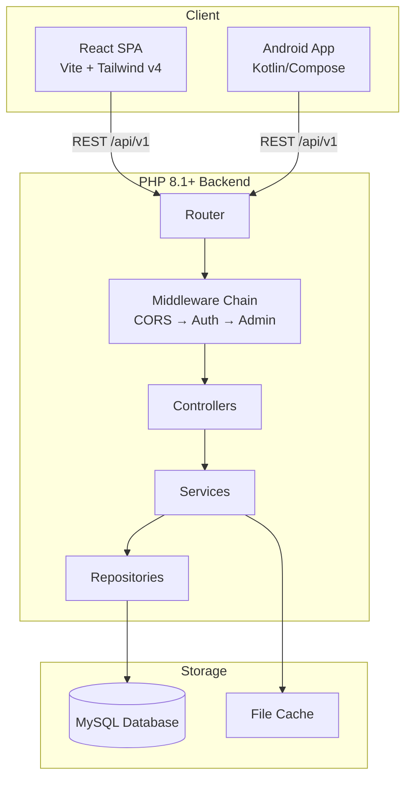
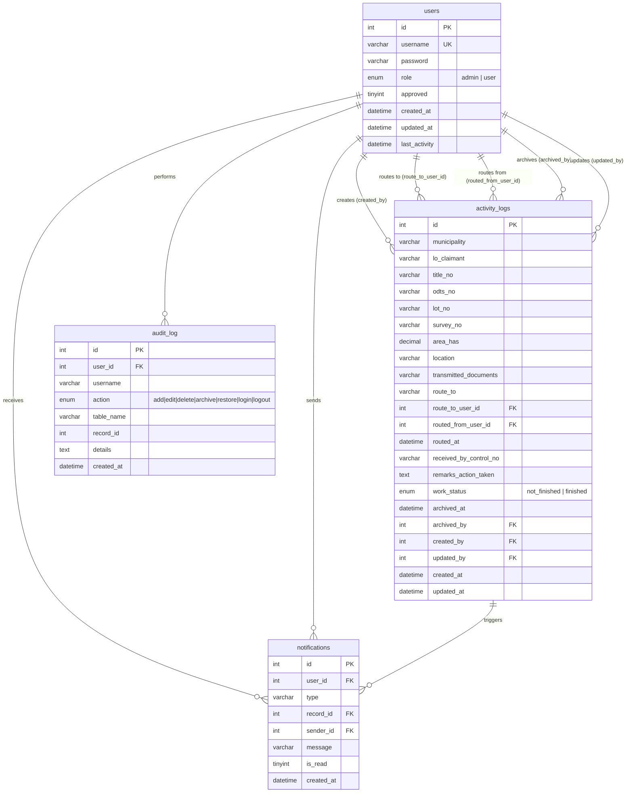

# DAR Activity Logs

Department of Agrarian Reform — Camarines Sur II. Web-based system for recording, managing, and monitoring in-and-out activity logs of documents and land records (title numbers, lot numbers, survey numbers, claimants).

## Architecture



## Database Schema



## Project Structure

```
dar_logs/
├── backend/              # PHP 8.1+ API + server
│   ├── public/           # Document root (front controller + SPA build)
│   ├── src/              # Modern API (PSR-4)
│   │   ├── Config/       # App & database configuration
│   │   ├── Controllers/  # Request handlers
│   │   ├── Core/         # Router, DI-like container, middleware, request/response
│   │   ├── Middleware/   # Auth, Admin, CORS
│   │   ├── Models/       # Data models
│   │   ├── Repositories/ # Data access layer (MySQL)
│   │   ├── Security/     # JWT, password hashing, input sanitization
│   │   ├── Services/     # Business logic
│   │   └── Validation/   # Request validators
│   ├── api/              # Legacy session-based API
│   ├── routes/           # Route definitions
│   ├── config/           # App & DB config files
│   ├── includes/         # Shared helpers
│   ├── storage/          # File cache & logs
│   └── vendor/           # Composer dependencies
├── frontend/             # React 19 SPA (Vite, TypeScript, Tailwind CSS v4)
│   └── src/
│       ├── api/          # API client modules
│       ├── components/   # UI components (shadcn/ui + custom)
│       ├── hooks/        # Custom React hooks
│       ├── lib/          # Utilities & JWT helpers
│       ├── pages/        # Route pages
│       └── stores/       # Zustand state stores
└── mobile_application/   # Kotlin / Jetpack Compose Android app
    └── app/src/main/java/com/example/darlogs/
        ├── data/         # Room DB, DAOs, entities, repository, sync
        └── ui/           # Compose UI components & theme
```

## Tech Stack

| Layer     | Technology                                                                 |
|-----------|---------------------------------------------------------------------------|
| Backend   | PHP 8.1+, MySQL, JWT auth, Composer PSR-4, custom framework               |
| Frontend  | React 19, TypeScript, Vite 8, Tailwind CSS v4, shadcn/ui, TanStack Query/Table, Zustand, React Router v7, React Hook Form + Zod |
| Mobile    | Kotlin, Jetpack Compose, Room DB, WorkManager, Biometrics                 |
| Deploy    | PowerShell scripts for Laragon (local) & InfinityFree (production)         |

## Environment Setup

### Prerequisites

- **PHP 8.1+** in PATH
- **Composer** in PATH
- **Node.js 18+** with npm
- **MySQL** (Laragon recommended for local dev)
- **Java 17+** & Android Studio (mobile only)

### Backend

```powershell
cd backend
composer install
cp .env.example .env    # then edit .env with your DB credentials
```

Required `.env` variables:

```env
DB_HOST=localhost
DB_PORT=3306
DB_NAME=dar_logs
DB_USER=root
DB_PASS=
DB_CHARSET=utf8mb4

APP_ENV=development
APP_DEBUG=true

JWT_SECRET=your-random-64-character-secret
JWT_EXPIRY=86400

AUDIT_LOG_CAPACITY=100
NOTIFICATION_CAP=50

CACHE_ENABLED=true
CACHE_TTL_STATS=30
CACHE_TTL_USERS=120
```

Create the database and import the schema:

```sql
CREATE DATABASE IF NOT EXISTS dar_logs CHARACTER SET utf8mb4 COLLATE utf8mb4_general_ci;
USE dar_logs;
SOURCE backend/database.sql;
```

### Frontend

```powershell
cd frontend
npm install
npm run dev          # Dev server → http://localhost:5173 (proxies API to :8080)
npm run build        # Outputs to backend/public/
```

### Mobile

Open `mobile_application/` in Android Studio, sync Gradle, and run on an emulator or device.

## API Endpoints

Base path: `/api/v1`

| Method | Endpoint                          | Auth   | Role   | Description                     |
|--------|-----------------------------------|--------|--------|---------------------------------|
| POST   | `/auth/login`                     | Public | —      | Login, returns JWT              |
| POST   | `/auth/register`                  | Public | —      | Register new user               |
| GET    | `/activities`                     | JWT    | —      | List activities (scoped)        |
| GET    | `/activities/archived`            | JWT    | Admin  | List archived records           |
| GET    | `/activities/{id}`                | JWT    | —      | Get single activity             |
| POST   | `/activities`                     | JWT    | —      | Create activity                 |
| PUT    | `/activities/{id}`                | JWT    | —      | Update activity                 |
| DELETE | `/activities/{id}`                | JWT    | —      | Archive activity                |
| POST   | `/activities/{id}/route`          | JWT    | —      | Route to another user           |
| POST   | `/activities/{id}/restore`        | JWT    | Admin  | Restore from archive            |
| DELETE | `/activities/{id}/permanent`      | JWT    | Admin  | Permanent delete                |
| GET    | `/audit`                          | JWT    | —      | Audit log                       |
| GET    | `/users`                          | JWT    | Admin  | List users                      |
| GET    | `/users/approved`                 | JWT    | —      | List approved users             |
| POST   | `/users`                          | JWT    | Admin  | Create user                     |
| GET    | `/users/{id}`                     | JWT    | Admin  | Get user                        |
| PUT    | `/users/{id}`                     | JWT    | Admin  | Update user                     |
| DELETE | `/users/{id}`                     | JWT    | Admin  | Delete user                     |
| GET    | `/notifications`                  | JWT    | —      | List notifications              |
| GET    | `/notifications/count`            | JWT    | —      | Unread count                    |
| PATCH  | `/notifications/{id}/read`        | JWT    | —      | Mark as read                    |
| POST   | `/notifications/read-all`         | JWT    | —      | Mark all read                   |
| GET    | `/notifications/stream`           | JWT    | —      | SSE stream for real-time        |
| GET    | `/dashboard/stats`                | JWT    | —      | Dashboard statistics            |
| GET    | `/dashboard/pending-count`        | JWT    | —      | Pending records count           |
| GET    | `/references/municipalities`      | JWT    | —      | Municipality reference list     |
| GET    | `/references/users`               | JWT    | —      | Available route target users    |

## Deployment

Automated scripts at the repo root:

| Script                       | Purpose                                            |
|------------------------------|----------------------------------------------------|
| `deploy-laragon.ps1`         | Local dev — builds frontend, syncs to Laragon, imports DB |
| `deploy-infinityfree.ps1`    | Production — builds, uploads via FTP to InfinityFree |

For detailed step-by-step deployment guides, see [`backend/DEPLOY.md`](backend/DEPLOY.md).

## Default Login

| Field    | Value      |
|----------|------------|
| Username | `admin`    |
| Password | `password` |

**Change immediately** after first login via Manage Accounts.

## License

Internal use — Department of Agrarian Reform Camarines Sur II.
