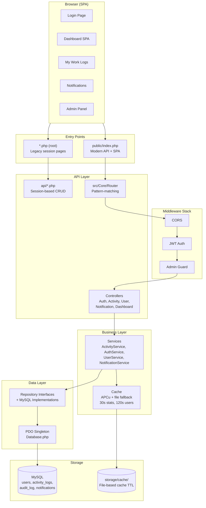
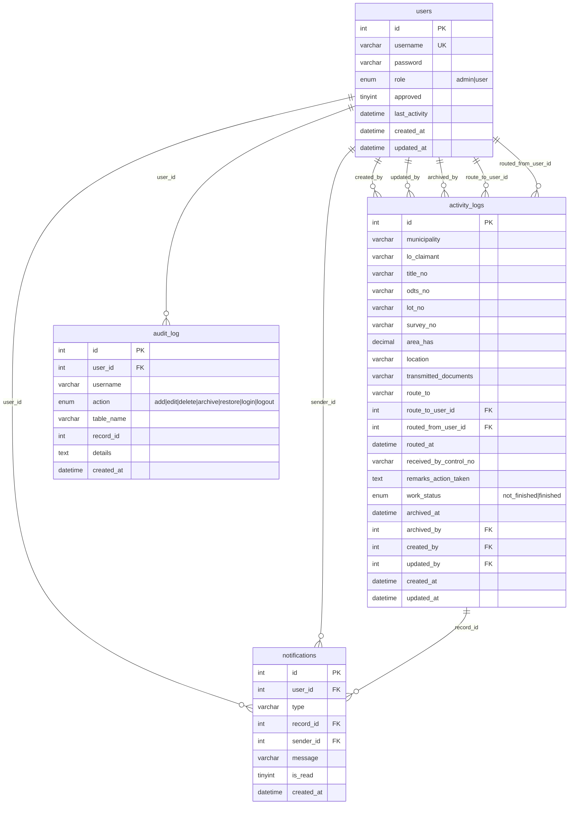

# DAR In and Out Activity Logs Management System

Department of Agrarian Reform Camarines Sur II — web-based system to record, manage, and monitor in-and-out activity logs of documents and land records.

## Project Structure (monorepo root: `dar_logs/`)

```
dar_logs/
├── backend/          # PHP 8.1+ API + server (this directory)
├── frontend/         # React + TypeScript SPA
└── mobile_application/ # Kotlin + Jetpack Compose Android app
```

## Architecture



## Database Schema



### Index Strategy

| Table | Index | Purpose |
|-------|-------|---------|
| users | `(approved, last_activity)` | Active user count queries |
| activity_logs | `(archived_at, work_status, created_by)` | Pending/wip filtering per user |
| activity_logs | `(archived_at, created_by, route_to_user_id)` | User-scoped records |
| activity_logs | `(archived_at, work_status)` | Dashboard counts |
| activity_logs | `(municipality, archived_at)` | Municipality filter chips |
| activity_logs | `lo_claimant(64), title_no, lot_no, received_by_control_no(64)` | Full-text search |
| audit_log | `(created_at, action)` | Recent edits in last 24h |
| notifications | `(user_id, is_read)` | Unread notification count |
| notifications | `(user_id, created_at)` | Notification listing |

All indexes auto-apply at runtime via `ensureSchema()` — no manual migration needed.

## Tech Stack

- **Backend:** PHP 8.1+, MySQL
- **Frontend:** Vanilla JS SPA (hash-based routing, no frameworks)
- **Auth:** JWT tokens (modern API) + PHP sessions (legacy)
- **Caching:** APCu with file-based fallback
- **Dependencies:** `vlucas/phpdotenv` (env loading), Composer PSR-4 autoloading

## Hosting

### Local Development (Laragon/XAMPP)

1. Run `..\deploy-laragon.ps1` from this directory (or from the monorepo root).
2. Create a MySQL database named `dar_logs`.
3. Import `database.sql`.
4. Run `composer install`.
5. Set the document root to `public/`.
6. Copy `.env.example` to `.env` and configure DB credentials.
7. Admin default: `admin` / `password` (after importing database.sql).

### InfinityFree Free Tier

The system is designed for InfinityFree with **~10 users/day**:

| Constraint | Limit | How We Handle It |
|-----------|-------|------------------|
| Execution time | ~10-15s | SSE capped at 9s, AJAX polling at 30s |
| Persistent connections | Blocked | Removed — standard PDO connections used |
| `set_time_limit()` | Disabled | Not called |
| APCu | Unavailable | Auto-detected, falls back to file cache |
| Hit limit | ~50K/day | 30s polling = ~2,880 hits/user/day — safe for 10 users |
| `FOREIGN_KEY_CHECKS` | Requires SUPER | Removed from `database.sql` |
| SSH/shell | Not available | Upload `vendor/` via FTP after local `composer install` |

**Deploy checklist:**

1. Upload all files via FTP to `htdocs/` (InfinityFree document root).
2. Import `database.sql` via phpMyAdmin (no `FOREIGN_KEY_CHECKS` needed).
3. Edit `.env` with InfinityFree MySQL credentials:
   ```
   DB_HOST=sqlXXX.epizy.com
   DB_NAME=epiz_XXXXX_dar_logs
   DB_USER=epiz_XXXXX
   DB_PASS=your_db_password
   ```
4. Upload `vendor/` directory (run `composer install` locally first).
5. Set `APP_ENV=production` and `APP_DEBUG=false` in `.env`.
6. Verify `.htaccess` at root blocks `.env` and sensitive files.
7. Run `https://yoursite.epizy.com/scripts/create_admin.php` once.

## User Roles

| Role | Capabilities |
|------|-------------|
| Admin | Approve users, add/edit/delete/archive/restore records, route to users, manage accounts, full dashboard. |
| User | Register, add/edit own records, view routed records. Cannot delete or manage users. |

## Default Login

- **Admin:** `admin` / `admin123` (after running `create_admin.php`) or `password` (from raw SQL).
- **Users:** Register via the login page — need admin approval.

## Project Structure

```
backend/
├── public/                        # ★ Document root (Apache)
│   ├── index.php                  # Single entry point (modern API + SPA fallback)
│   ├── index.html                 # SPA shell
│   └── .htaccess                  # URL rewriting
├── src/                           # Modern API (SOLID, PSR-4)
│   ├── Config/                    # AppConfig (dotenv), DatabaseConfig (PDO factory)
│   ├── Core/                      # Router, Request, Response, Database, Cache
│   ├── Controllers/               # Auth, Activity, User, Notification, Dashboard
│   ├── Services/                  # Business logic + cache invalidation
│   ├── Repositories/              # Interfaces + Mysql implementations
│   ├── Models/                    # ActivityLog, User, AuditLog, Notification
│   ├── Middleware/                # AuthMiddleware (JWT), AdminMiddleware, Cors
│   ├── Security/                  # JwtHandler, PasswordHasher, Sanitizer
│   ├── Validation/                # Input validators
│   ├── Exceptions/                # Typed HTTP exceptions
│   └── Helpers/                   # Municipalities (static catalog)
├── api/                           # Legacy session-based API (procedural)
│   ├── dashboard.php              # Stats (single query, cached 30s)
│   ├── records.php                # CRUD for activity_logs
│   ├── sse_counts.php             # SSE endpoint (10s max)
│   ├── route_users.php            # User list for routing dropdown (cached)
│   └── ...                        # archive, audit, login, register, etc.
├── includes/                      # Legacy shared helpers
│   ├── auth.php                   # Session & role helpers + user index migration
│   ├── activity_logs.php          # Schema migration + index migration
│   ├── notifications.php          # Notification schema + index migration
│   ├── audit.php                  # Audit log + index migration
│   ├── municipalities.php         # Municipality catalog
│   └── cache.php                  # Procedural cache wrapper (file-based)
├── assets/                        # Frontend CSS, JS, images
│   ├── css/style.css
│   └── js/
│       ├── dashboard.js           # Main dashboard SPA (30s polling)
│       ├── realtime.js            # SSE client + route notification popup
│       ├── notifications-badge.js # Unread notification badge
│       └── pending-badge.js       # Pending records badge
├── routes/api.php                 # Modern API route definitions
├── storage/cache/                 # File cache directory (auto-created)
├── storage/logs/                  # Log files
├── vendor/                        # Composer dependencies
├── bootstrap.php                  # Autoloader + error handler + cache init
├── database.sql                   # Schema + indexes (InfinityFree compatible)
├── composer.json                  # PSR-4 + phpdotenv
├── .env / .env.example            # Environment configuration
├── .htaccess                      # Blocks sensitive files at root
├── .user.ini                      # InfinityFree PHP settings
├── dashboard.php                  # Legacy dashboard SPA
└── *.php (root)                   # Other legacy page files
```

## Caching

| Cache Key | TTL | Invalidated By |
|-----------|-----|----------------|
| `dashboard_stats` | 30s | Any activity create/update/archive/restore/delete/route |
| `pending_count_*` | 15s | Any activity mutation |
| `approved_users` | 120s | User create/update/delete |
| `route_users_*` | 120s | User changes (legacy path) |

Cache uses APCu if available, otherwise atomic file-based writes (`storage/cache/`).

## Security

- Passwords stored with `password_hash()` (bcrypt, cost 12).
- JWT Bearer tokens (modern API) + PHP sessions (legacy).
- Role checks enforced server-side on all endpoints.
- `.env` and sensitive files blocked by `.htaccess`.
- SQL injection prevented via PDO prepared statements.
- XSS mitigated via `htmlspecialchars()` output encoding.
